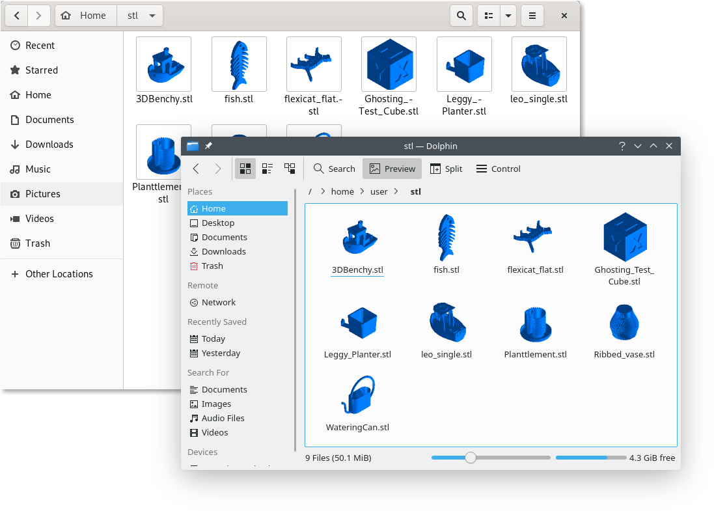

# stl2thumbnail
A standalone rasterizing STL thumbnail generator for the Linux Desktop(s).

Notice: This thumbnailer also works in sandboxed environments.

## Preview


## Installation

### Arch Linux
Use the AUR: https://aur.archlinux.org/packages/stl2thumbnail-git

### Other distributions
```
git clone https://github.com/krepa098/stl2thumbnail && cd stl2thumbnail
cmake -DCMAKE_INSTALL_PREFIX="/usr"
cmake --build . --config Release
sudo make install
```

## License
Code released under the GPLv3 license.
